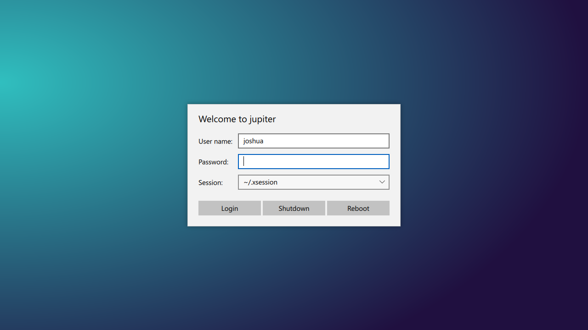

## About this fork
This is a fork of Joshua Krämer's sddm theme. IMHO It's the best sddm theme possible: just two text boxes for the username and the password. Nothing more. Nothing less.
I'm going to use it to authenticate in my LDAP server, so I've made 2 changes: focus is on the username's textbox and it's blank by default. Original theme fills it with last username and puts the focus on the password's textbox.

## Description
This is an [SDDM](https://github.com/sddm/sddm) theme consisting of a simple login dialog. It is built with [Qt Quick Controls](https://doc.qt.io/qt-5/qtquickcontrols-index.html). Its appearance depends on the selected Qt Quick style (see below for configuration options).


*Screenshot with Qt Quick style "Universal"*

## Dependencies
* sddm
* qt5-quickcontrols2
* qt5-graphicaleffects

## Installation
1. Download the archive [`master.zip`](https://github.com/joshuakraemer/sddm-theme-dialog/archive/master.zip), which contains a snapshot of the Git repo:

    ```
    wget https://github.com/joshuakraemer/sddm-theme-dialog/archive/master.zip
    ```

2. Extract the archive to SDDM's theme directory:

    ```
    $ sudo unzip master.zip -d /usr/share/sddm/themes/
    ```

3. The theme must be enabled in one of SDDM's configuration files. Either the file `/etc/sddm.conf` or a file in the directory `/etc/sddm.conf.d/` can be used (refer to `man sddm.conf` for details). In the section `[Theme]` in one of the files, set `Current` to `dialog`:

    ```
    [Theme]
    Current=dialog
    ```

## Configuration
The theme can be configured by editing the file `theme.conf`. This file must contain a single section `[General]`. The following settings are available:

key | description | default value
--- | --- | ---
`style` | Qt Quick style | `Default`
`highlightColor` | color of selected elements | depends on style
`backgroundColor` | background color | `#808080`
`backgroundImage` | path to background image | none

Refer to [Qt's documentation](https://doc.qt.io/qt-5/qtquickcontrols2-styles.html) for available styles. Colors must be specified in the format `#rrggbb`. The setting `highlightColor` is only effective if the styles "Default" or "Fusion" are used. To change the highlight color with the styles "Material" and "Universal", system-wide Qt Quick settings must be used (see below).

## System-wide Qt Quick settings
System-wide Qt Quick settings can be used to control the appearance of all Qt Quick applications, including this SDDM theme. It is possible to select a Qt Quick style and configure the widget colors in detail by using a configuration file. This works as follows:

1. Create a configuration file, for example `/etc/qtquickcontrols2.conf`. The name of the file can be chosen freely.
2. Refer to [Qt's documentation](https://doc.qt.io/qt-5/qtquickcontrols2-configuration.html) for possible settings. The following example enables the dark variant of the style "Material" and sets a cyan highlight color:

    ```
    [Controls]
    Style=Material

    [Material]
    Theme=Dark
    Accent=#80bfbf
    ```

2. Enable the file by setting the environment variable `QT_QUICK_CONTROLS_CONF` to its path:

    ```
    sudo echo 'QT_QUICK_CONTROLS_CONF=/etc/qtquickcontrols2.conf' >> /etc/environment
    ```

## License
This software is provided under the ISC license. See the file [`LICENSE`](LICENSE) for details.
